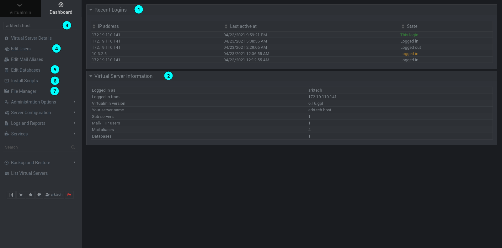

#### The dashboard is where you are landed after first logging into your web control panel. Do not feel overwhelmed, majority of the information and pages you can explore will not be necessary to the majority of you. The options are just there, however.

We will break down the front page so you will be able to better interpret and troubleshoot the information in front of you.
The numbers in the picture will correspond to the ones in this guide, and many options will not be explained here however the ones you're likely to come across will be listed here.
___

#### 1. Recent Logins
This section will show you logs about who's currently logged in and their last activity date. The IP addresses here can be utilized to identify users, or know if there was an unpermitted login if it's an unknown address.

#### 2. Virtual Server Information
The information here will give you a brief overview of your website's information, including ArkTech's Virtualmin version and your IP to compare against the Recent Logins section.

#### 3. The Current Website
If you have multiple websites with ArkTech, you'll be able to click here and get a drop-down menu to select between different virtual web servers you have with us.

#### 4. Edit Users
You can allow other users to work on your website and restrict their permissions if need be, useful for multiple people working on a project without having to share a single account.

#### 5. Edit Databases
You can add/remove and modify your database server here, this is useful if you want to have some form of backend for your website or have a project such as a game server and use it to synchronize data between servers in realtime.

#### 6. Install Scripts
This is a useful place to go for getting setup immediately with popular tools & frameworks such as WordPress, PHPMyAdmin, Django and others without requiring technical knowledge.
This will run a script that installs the software, configures it, and is immediately available for you to start building on.

#### 7. File Manager
This is your bread & butter metaphorically speaking, your site files will go into here and will be immediately on your webserver. You can do a lot here, including archiving and extracting files.

#
